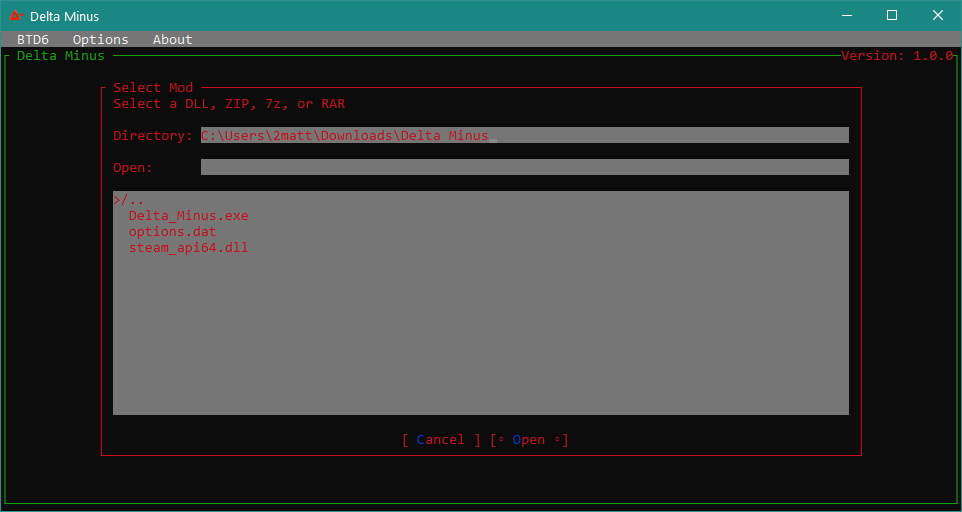
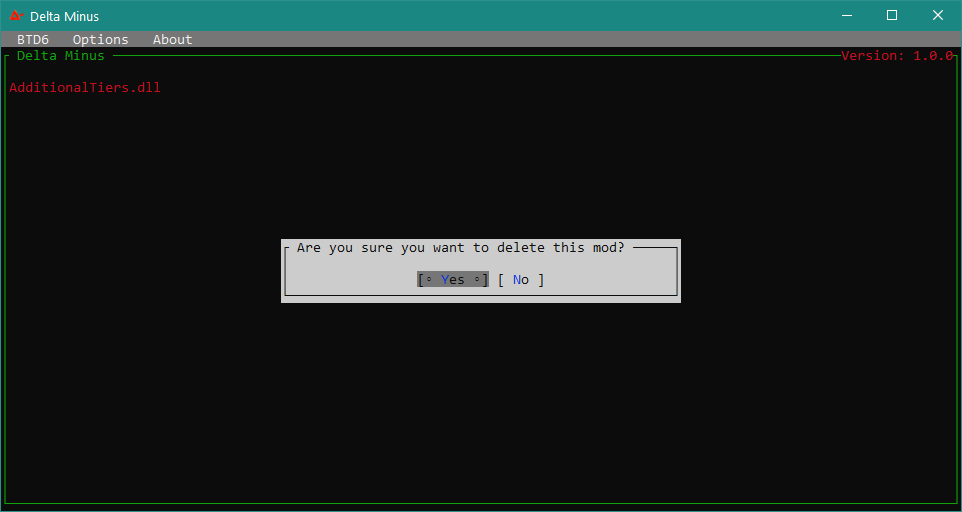

<h1 align="center">Delta Minus Docs<h1/>
<h2 align="center">Setup Guide<h2/>
<h3>
1. Download the application for your 
<a href="https://stackoverflow.com/a/42309484/12427280">.NET version</a> from <a href="https://github.com/1330-Studios/Delta-Minus/releases">our releases</a> 
2. Make sure Steam is open 
3. Run the application 

<h3 align="center">It's that simple.<h3/>
 
<h3>

<h1 align="center">How to use Delta Minus<h3/>

<h2 align="center">Adding Mods<h3/>
You are able to add mods by clicking on "BTD6" on the menu bar then "Add" or by pressing CRTL + A. You will then be greeted by this menu.

All you need to do then is double click a mod and it will be added to your mods list and will be ran on the game starting!

<h2 align="center">Removing Mods<h3/>
To remove mods, just click on the name of any mod shown on the list and this pop-up will appear.

From here you can choose if you wish to go through with deleting the selected mod or not.
